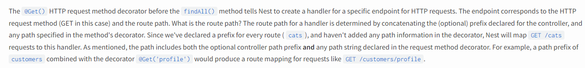

# 装饰器

随着TypeScript和ES6里引入了类，在一些场景下我们需要额外的特性来支持**标注或修改类及其成员。**

> 虽然可以修改类及其成员，但是在学习中发现，修改类及其成员的行为是非常危险的

## 装饰器是什么

装饰器是一种特殊类型的声明，它可以被附加到类声明，方法，访问符，属性或参数上。

### 类装饰器

类装饰器表达式会在运行时当作函数被调用，类的构造函数作为其唯一的参数。如果类装饰器返回一个值，它会使用提供的构造函数来替换类的声明。

- 下面通过一个动物园的例子来介绍一下类装饰器，**这里对类进行了修改，重载了构造函数**

```ts
const zooArea = {};
const addAnimal = (key, value) => {
  if (zooArea[key]) {
    zooArea[key].push(value);
  } else {
    zooArea[key] = [value];
  }
};
const getArea = (key) => zooArea[key];

const Zoo = ({
  family,
  desc,
}) => {
  return (constructor: Function) => {
    console.log('Zoo doing!')
    return function (name: string) {
      addAnimal(family, { desc, name });
      return new (constructor as any)(name);
    } as any
  }
};
class Animal {
  name: string;
  constructor(name: string) {
    this.name = name;
  }
}

@Zoo({
  family: '猫科',
  desc: '只是普通的小猫咪，偶尔抓只小鸟或老鼠'
})
class Cat extends Animal{
  constructor(name: string) {
    super(name);
  }
}

@Zoo({
  family: '犬科',
  desc: '这是一只可爱的小狗，但是大多数人来动物园都不是为了看它'
})
class Dog extends Animal{
  constructor(name: string) {
    super(name);
  }
}

@Zoo({
  family: '猫科',
  desc: '老虎是动物园里面最受小朋友欢迎的之一'
})
class Tiger extends Animal{
  constructor(name: string) {
    super(name);
  }
}

const cat_1 = new Cat('小红');
const cat_2 = new Cat('小明');
const cat_3 = new Cat('小张');
const cat_4 = new Cat('小亮');

const dog_1 = new Dog('张三');
const dog_2 = new Dog('李四');
const dog_3 = new Dog('王五');

const tiger_1 = new Tiger('甲');
const tiger_2 = new Tiger('乙');
const tiger_3 = new Tiger('丙');
const tiger_4 = new Tiger('丁');

console.log(zooArea)
/*
输出：
{ '猫科':
   [ { desc: '只是普通的小猫咪，偶尔抓只小鸟或老鼠', name: '小红' },
     { desc: '只是普通的小猫咪，偶尔抓只小鸟或老鼠', name: '小明' },
     { desc: '只是普通的小猫咪，偶尔抓只小鸟或老鼠', name: '小张' },
     { desc: '只是普通的小猫咪，偶尔抓只小鸟或老鼠', name: '小亮' },
     { desc: '老虎是动物园里面最受小朋友欢迎的之一', name: '甲' },
     { desc: '老虎是动物园里面最受小朋友欢迎的之一', name: '乙' },
     { desc: '老虎是动物园里面最受小朋友欢迎的之一', name: '丙' },
     { desc: '老虎是动物园里面最受小朋友欢迎的之一', name: '丁' } ],
  '犬科':
   [ { desc: '这是一只可爱的小狗，但是大多数人来动物园都不是为了看它', name: '张三' },   
     { desc: '这是一只可爱的小狗，但是大多数人来动物园都不是为了看它', name: '李四' },   
     { desc: '这是一只可爱的小狗，但是大多数人来动物园都不是为了看它', name: '王五' } ] }
*/
```

### 方法装饰器

方法装饰器声明在一个方法的声明之前（紧靠着方法声明）。 它会被应用到方法的 属性描述符上，可以用来监视，修改或者替换方法定义。 方法装饰器不能用在声明文件( .d.ts)，重载或者任何外部上下文（比如declare的类）中。

- 方法装饰器表达式会在运行时当作函数被调用，传入下列3个参数：

1. 对于静态成员来说是类的构造函数，对于实例成员是类的原型对象。
2. 成员的名字。
3. 成员的属性描述符。


#### nestJs中的Get装饰器

在nestjs中，我们经常接触到装饰器，这里解析一下Get装饰器做了什么。

```ts
import { Controller, Get } from '@nestjs/common';

@Controller('cats')
export class CatsController {
  @Get()
  findAll(): string {
    return 'This action returns all cats';
  }
}
```

- 在文档中是这么介绍上述代码的作用的。



大致意思是：`findAll`方法上面的HTTP方法装饰器会为HTTP请求的创建一个特殊处理：为特定请求`/cats`的路径映射到这个`findAll`方法上。这个路径是由于类构造器`@Controller`为这个类声明了一个前缀`cats`，而方法装饰器`Get`则没有添加任何路径信息，所以是`/cats`。

### NestJS中方法装饰器Get源码梳理

```ts
export const Get = createMappingDecorator(RequestMethod.GET);

export const PATH_METADATA = 'path';
export const METHOD_METADATA = 'method';

const createMappingDecorator =
  (method: RequestMethod) =>
  (path?: string | string[]): MethodDecorator => {
    return RequestMapping({
      [PATH_METADATA]: path,
      [METHOD_METADATA]: method,
    });
  };

/**
 * 这里是一个工厂函数，获取实际的HTTP装饰器
 */
export const RequestMapping = (
  metadata: RequestMappingMetadata = defaultMetadata,
): MethodDecorator => {
  const pathMetadata = metadata[PATH_METADATA];
  const path = pathMetadata && pathMetadata.length ? pathMetadata : '/'; // 从这里可以看到当path不存在的时候，默认是 '/'
  const requestMethod = metadata[METHOD_METADATA] || RequestMethod.GET;

  return (
    target: object,
    key: string | symbol,
    descriptor: TypedPropertyDescriptor<any>,
  ) => {
    Reflect.defineMetadata(PATH_METADATA, path, descriptor.value);
    Reflect.defineMetadata(METHOD_METADATA, requestMethod, descriptor.value);
    return descriptor;
  };
};
```

---

### 属性装饰器

- 属性装饰器表达式会在运行时当作函数被调用，传入下列2个参数：

1. 对于静态成员来说是类的构造函数，对于实例成员是类的原型对象。
2. 成员的名字。

#### mock-decorator

> https://github.com/Yeyanbin/mock-decorator 代码库在这里

mock-decorator是基于属性装饰器和fakerjs来做的一个mock工具。

我们可以用他来基于贫血模型创建一些模拟数据。

> 贫血模型可以先简单理解为只有属性的类。（或者说只包含数据，不包含业务逻辑）

```ts
class Date {
  @NumberMock({ max: 2020, min: 2010, isInt: true })
  year: number;

  @NumberMock({ max: 13, min: 1, isInt: true })
  month: number;
}

class Skill {
  @EnumMock(['卖萌', '捕猎', '跑酷', '抓老鼠'])
  name: string;

  @NumberMock({
    max: 100
  })
  level: number;
}

class Cat {
  @Name.lastName('male')
  name: string;

  @ObjectMock(Date)
  brithday: Date;

  @ArrayMock({ max: 4 })
  @Name.findName()
  firendsName: string[]

  @ArrayMock({ min: 1, max: 3 })
  @ObjectMock(Skill)
  skills: Skill[]
}

console.log(MockDataStore.instance.targetMap);

const cat_1 = handleMockBehavior(Cat);
const cat_2 = handleMockBehavior(Cat);
const cat_3 = handleMockBehavior(Cat);

console.log('cat_1', cat_1);
console.log('cat_2', cat_2);
console.log('cat_3', cat_3);
/*
生成随机数据的输出：
cat_1 { name: 'Roberts',
  brithday: { year: 2017, month: 12 },
  firendsName: [ 'Sean Price' ],
  skills:
   [ { name: '卖萌', level: 6.7813479251336295 },
     { name: '捕猎', level: 95.58251369601594 } ] }
cat_2 { name: 'Olson',
  brithday: { year: 2013, month: 3 },
  firendsName: [ 'Ms. Pam Hodkiewicz', 'Leslie Bednar' ],
  skills:
   [ { name: '捕猎', level: 74.36836676938398 },
     { name: '捕猎', level: 22.77025925417544 },
     { name: '跑酷', level: 35.21808489069889 } ] }
cat_3 { name: 'Conn',
  brithday: { year: 2012, month: 6 },
  firendsName: [ 'Beatrice Koss' ],
  skills:
   [ { name: '卖萌', level: 44.026811694055844 },
     { name: '抓老鼠', level: 11.329242733894706 },
     { name: '跑酷', level: 99.4451728462999 } ] }
*/

```

#### 基本设计

- mock-decorator 分为三个模块

1. decorator 装饰器
2. MockDataStore mock数据存储器
3. behavior 行为处理

可以理解为：先用装饰器往MockDataStore中输入Mock行为数据，然后执行`handleMockBehavior`方法，处理MockDataStore中的Mock行为数据。

##### NumberMock的逻辑梳理

属性装饰器NumberMock，往MockDataStore注入Mock行为数据

```ts
class Date {
  @NumberMock({ max: 2020, min: 2010, isInt: true })
  year: number;

  @NumberMock({ max: 13, min: 1, isInt: true })
  month: number;
}


/**
 * 随机数范围区间为： [min, max]，isInt代表是否取整。
 */
export const NumberMock = (options: { max?: number, min?: number, isInt?: boolean }) => {
  const max = options.max ?? 100;
  const min = options.min ?? 0;
  const isInt = options.isInt ?? false;

  return useMockBehavior({
    [isNumberKey]: {
      max,
      min,
      isInt,
    }
  })
}

export const useMockBehavior = (params) => {

  // 属性装饰器函数
  return (target: any, propertyKey: string) => {

    // 注入Mock行为数据
    Object.keys(params).forEach((paramKey) => {
      MockDataStore.instance.addMockData(target.constructor, propertyKey, paramKey, params[paramKey]);
    })
  };
};

```

处理属性装饰器NumberMock

```ts
export const handleMockBehavior = (target: Function) => {
  
  // 获取类构造函数为key的Mock数据 
  const targetData = MockDataStore.instance.getMockData(target);

  // 类的实例
  const targetInstance = {};

  // 该类没有Mock数据
  if (!targetData) return

  // 分别处理各个参数
  Object.keys(targetData).forEach((key) => {
    
    // 如果这个参数有Mock行为数据 
    if (targetData[key]) {
      
      // 判断是不是数组
      const length = handleArrayBehavior(targetData[key]);
      if (!!length) {
        // 是数组
        const result = [];
        for(let i = 0; i<length ;++i) {
          // 处理值数据
          result.push(handleValueBehaviors(targetData[key]));
        }
        targetInstance[key] = result;
      } else {
        targetInstance[key] = handleValueBehaviors(targetData[key]);
      }
    }
  });

  return targetInstance;
}

// 优先级，Object > Number > faker > Enum
const handleValueBehaviors = (data) => {
  let result;
  result = handleObjectBehavior(data);
  result = result ?? handleNumberBehavior(data); 
  result = result ?? handleFakeBehavior(data);
  result = result ?? handleEnumBehavior(data);

  return result;
}

// number
const handleNumberBehavior = (data) => {
  let numberBehavior
  if (numberBehavior = data[typeKeys.isNumberKey]) {
    const { max, min, isInt } = numberBehavior;
    
    // 获取随机数据
    const result = Math.random() * (max - min) + min;

    // 如果是整数就取整
    return isInt ? Math.floor(result) : result;
  }
  return
}

```

### 参数装饰器

参数装饰器声明在一个参数声明之前（紧靠着参数声明）。 参数装饰器应用于类构造函数或方法声明。

- 参数装饰器表达式会在运行时当作函数被调用，传入下列3个参数：

1. 对于静态成员来说是类的构造函数，对于实例成员是类的原型对象。
2. 成员的名字。
3. 参数在函数参数列表中的索引。

> 注意:
>
> 1. 参数装饰器只能用来监视一个方法的参数是否被传入。
> 2. 参数装饰器的返回值会被忽略。
>

例如可以用方法装饰器和参数装饰器，设计一个**运行时**的参数校验。

```ts
class Greeter {
    greeting: string;

    constructor(message: string) {
        this.greeting = message;
    }

    @validate
    greet(@required name: string) {
        return "Hello " + name + ", " + this.greeting;
    }
}


import "reflect-metadata";

const requiredMetadataKey = Symbol("required");

// 参数构造器 
function required(target: Object, propertyKey: string | symbol, parameterIndex: number) {
    let existingRequiredParameters: number[] = Reflect.getOwnMetadata(requiredMetadataKey, target, propertyKey) || [];
    existingRequiredParameters.push(parameterIndex);

    // 注入校验数据
    Reflect.defineMetadata(requiredMetadataKey, existingRequiredParameters, target, propertyKey);
}

// 方法构造器
function validate(target: any, propertyName: string, descriptor: TypedPropertyDescriptor<Function>) {

    // 原来的方法，就是上面的greet方法
    let method = descriptor.value;

    // 这里重载了函数
    descriptor.value = function () {
        let requiredParameters: number[] = Reflect.getOwnMetadata(requiredMetadataKey, target, propertyName);
        if (requiredParameters) {
            for (let parameterIndex of requiredParameters) {
                if (parameterIndex >= arguments.length || arguments[parameterIndex] === undefined) {
                    throw new Error("Missing required argument.");
                }
            }
        }

        // 调用回原来的方法
        return method.apply(this, arguments);
    }
}
```

# 基于装饰器工具

## class-validator

https://github.com/typestack/class-validator

使用基于装饰器和非装饰器的验证，基于validator.js执行验证。适用于浏览器和node环境。

### 官方例子

```ts
import {
  validate,
  validateOrReject,
  Contains,
  IsInt,
  Length,
  IsEmail,
  IsFQDN,
  IsDate,
  Min,
  Max,
} from 'class-validator';

export class Post {
  @Length(10, 20)
  title: string;

  @Contains('hello')
  text: string;

  @IsInt()
  @Min(0)
  @Max(10)
  rating: number;

  @IsEmail()
  email: string;

  @IsFQDN()
  site: string;

  @IsDate()
  createDate: Date;
}

let post = new Post();
post.title = 'Hello'; // should not pass
post.text = 'this is a great post about hell world'; // should not pass
post.rating = 11; // should not pass
post.email = 'google.com'; // should not pass
post.site = 'googlecom'; // should not pass

validate(post).then(errors => {
  // errors is an array of validation errors
  if (errors.length > 0) {
    console.log('validation failed. errors: ', errors);
  } else {
    console.log('validation succeed');
  }
});

validateOrReject(post).catch(errors => {
  console.log('Promise rejected (validation failed). Errors: ', errors);
});
// or
async function validateOrRejectExample(input) {
  try {
    await validateOrReject(input);
  } catch (errors) {
    console.log('Caught promise rejection (validation failed). Errors: ', errors);
  }
}
```

## class-transformer

Class-transformer用于类对象和普通对象之间转换，还提供了序列号和反序列化功能。

### 官方示例

我们有一个json文件 `users.json`和`user`类，则可以将其转换为类user的实例对象。

```json
[
  {
    "id": 1,
    "firstName": "Johny",
    "lastName": "Cage",
    "age": 27
  },
  {
    "id": 2,
    "firstName": "Ismoil",
    "lastName": "Somoni",
    "age": 50
  },
  {
    "id": 3,
    "firstName": "Luke",
    "lastName": "Dacascos",
    "age": 12
  }
]
```

```ts
export class User {
  id: number;
  firstName: string;
  lastName: string;
  age: number;

  getName() {
    return this.firstName + ' ' + this.lastName;
  }

  isAdult() {
    return this.age > 36 && this.age < 60;
  }
}

fetch('users.json').then((users: Object[]) => {
  const realUsers = plainToClass(User, users);
  // now each user in realUsers is an instance of User class
});
```

# 其他注意事项

## 装饰器的顺序

- 类中不同声明上的装饰器将按以下规定的顺序应用

1. 参数装饰器，然后依次是方法装饰器，访问符装饰器，或属性装饰器应用到每个实例成员。
2. 参数装饰器，然后依次是方法装饰器，访问符装饰器，或属性装饰器应用到每个静态成员。
3. 参数装饰器应用到构造函数。
4. 类装饰器应用到类。

- 当多个装饰器应用在一个声明上时会进行如下步骤的操作：

1. 由上至下依次对装饰器表达式求值。
2. 求值的结果会被当作函数，由下至上依次调用。

## 最简单的装饰器

> 无论怎么封装，装饰器本质上是Function

```ts

// 类装饰器
function ClassDecorator(constructor: Function) {
  console.log('类装饰器 done');
}

// 方法装饰器
function FunctionDecorator(target, propertyKey: string, descriptor: PropertyDescriptor) {
  console.log('方法装饰器 done');

}

// 属性装饰器
function PropertDecorator(target: any, propertyKey: string) {
  console.log('属性装饰器 done');

}

// 参数装饰器
function ParamsDecorator(target: Object, propertyKey: string | symbol, parameterIndex: number) {
  console.log('参数装饰器 done');

}

@ClassDecorator
class Demo {
  @PropertDecorator
  Propert: any;

  @FunctionDecorator
  func(@ParamsDecorator paramA) {}
}

/*
执行顺序：

属性装饰器 done
参数装饰器 done
方法装饰器 done
类装饰器 done
*/
```
