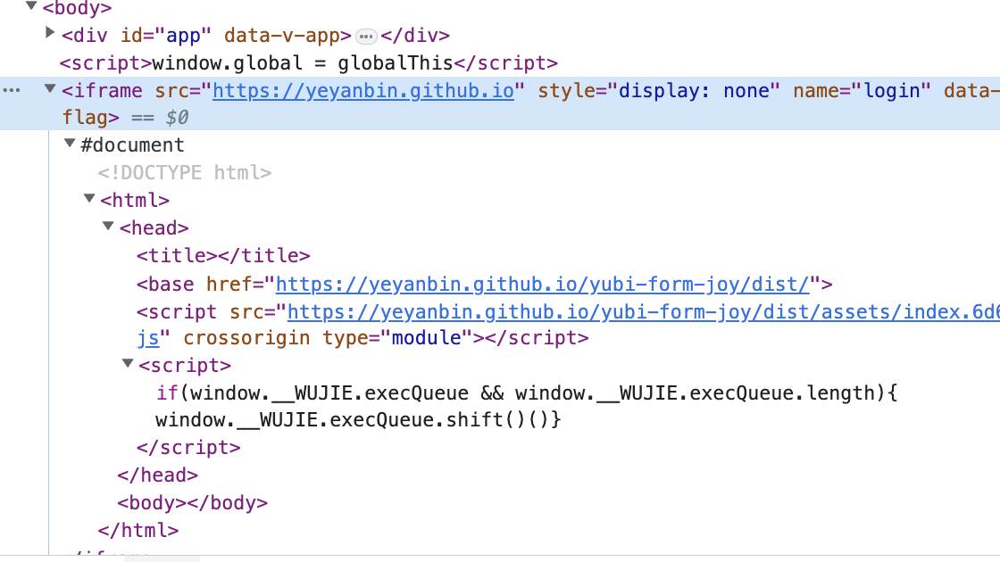

# wujie方案做了什么？

> 主要是想了解一下iframe的优化

在React和Vue都提供了组件库去封装使用。在这里以wujie-vue3起点，好好探究一下wujie方案做了什么。

## wujie-vue3

### 插件注册

这里只是注册组件和设置属性而已
```js
// https://github.com/Tencent/wujie/blob/24a8a4cc9fe49a1be2c854acfddcbe752d7c3fe6/packages/wujie-vue3/index.js#L96
WujieVue.setupApp = setupApp;
WujieVue.preloadApp = preloadApp;
WujieVue.bus = bus;
WujieVue.destroyApp = destroyApp;

WujieVue.install = function (app) {
  app.component("WujieVue", WujieVue);
};
```
### 组件运行

我们可以看到在组件的生命周期mounted的时候，执行了`wujie-core`的startApp方法。

```js
// https://github.com/Tencent/wujie/blob/24a8a4cc9fe49a1be2c854acfddcbe752d7c3fe6/packages/wujie-vue3/index.js#L36
mounted() {
  bus.$onAll(this.handleEmit);
  // 这里执行了execStartApp
  this.execStartApp();
  this.$watch(
    () => this.name + this.url,
    () => this.execStartApp()
  );
},

// 看起来这个部分就是关键了，
execStartApp() {
  this.startAppQueue = this.startAppQueue.then(async () => {
    try {
      this.destroy = await startApp({
        name: this.name,
        url: this.url,
        el: this.$refs.wujie,
        alive: this.alive,
        fetch: this.fetch,
        props: this.props,
        attrs: this.attrs,
        replace: this.replace,
        sync: this.sync,
        prefix: this.prefix,
        fiber: this.fiber,
        degrade: this.degrade,
        plugins: this.plugins,
        beforeLoad: this.beforeLoad,
        beforeMount: this.beforeMount,
        afterMount: this.afterMount,
        beforeUnmount: this.beforeUnmount,
        afterUnmount: this.afterUnmount,
        activated: this.activated,
        deactivated: this.deactivated,
        loadError: this.loadError,
      });
    } catch (error) {
      console.log(error);
    }
  });
},

```


### wujie-core

在阅读wujie-core的startApp方法之后，我们可以发现实际初始化创建了一个`WuJie`实例，其便是创建了一个沙箱。

```js
// https://github.com/Tencent/wujie/blob/91e6404b3122974c2a8ed643e740c68704e0bb07/packages/wujie-core/src/index.ts#L142

export async function startApp({
  /* ...省略 */
}: startOptions): Promise<Function | void> {
  const sandbox = getSandboxById(name);
  const lifecycles = {
  /* ...省略 */
  };
  // 已经初始化过的应用，快速渲染
  if (sandbox) {
    sandbox.lifecycles = lifecycles;
    const iframeWindow = sandbox.iframe.contentWindow;
    if (sandbox.preload) {
      await Promise.resolve(sandbox.preload);
    }
    if (alive) {
      // 保活
      await sandbox.active({ url, sync, prefix, el, props, alive, fetch, replace });
      // 预加载但是没有执行的情况
      if (!sandbox.execFlag) {
        sandbox.lifecycles?.beforeLoad?.(sandbox.iframe.contentWindow);
        const { getExternalScripts } = await importHTML(url, {
          fetch: fetch || window.fetch,
          plugins: sandbox.plugins,
          loadError: sandbox.lifecycles.loadError,
        });
        await sandbox.start(getExternalScripts);
      }
      sandbox.lifecycles?.activated?.(sandbox.iframe.contentWindow);
      return sandbox.destroy;
    } else if (isFunction(iframeWindow.__WUJIE_MOUNT)) {
      /**
       * 子应用切换会触发webcomponent的disconnectedCallback调用sandbox.unmount进行实例销毁
       * 此处是防止没有销毁webcomponent时调用startApp的情况，需要手动调用unmount
       */
      sandbox.unmount();
      await sandbox.active({ url, sync, prefix, el, props, alive, fetch, replace });
      // 有渲染函数
      sandbox.lifecycles?.beforeMount?.(sandbox.iframe.contentWindow);
      iframeWindow.__WUJIE_MOUNT();
      sandbox.lifecycles?.afterMount?.(sandbox.iframe.contentWindow);
      sandbox.mountFlag = true;
      sandbox.rebuildStyleSheets();
      return sandbox.destroy;
    } else {
      // 没有渲染函数
      sandbox.destroy();
    }
  }

  // 这里就是没有初始化的wujie应用初始化的情况
  const newSandbox = new WuJie({ name, url, attrs, fiber, degrade, plugins, lifecycles });
  newSandbox.lifecycles?.beforeLoad?.(newSandbox.iframe.contentWindow);
  const { template, getExternalScripts, getExternalStyleSheets } = await importHTML(url, {
    fetch: fetch || window.fetch,
    plugins: newSandbox.plugins,
    loadError: newSandbox.lifecycles.loadError,
  });

  const processedHtml = await processCssLoader(newSandbox, template, getExternalStyleSheets);
  await newSandbox.active({ url, sync, prefix, template: processedHtml, el, props, alive, fetch, replace });
  await newSandbox.start(getExternalScripts);
  return newSandbox.destroy;
}

```


### 沙箱的创建

沙箱的代码注释友好得有点感人啊。

我们先不管应用降级的与代理window的内容，这里只需要关注`iframeGenerator`方法，其创建了iframe。

```js
// https://github.com/Tencent/wujie/blob/91e6404b3122974c2a8ed643e740c68704e0bb07/packages/wujie-core/src/sandbox.ts#L421
// Wujie的构造函数
  /**
   * @param id 子应用的id，唯一标识
   * @param url 子应用的url，可以包含protocol、host、path、query、hash
   */
  constructor(options: {
    name: string;
    url: string;
    attrs: { [key: string]: any };
    degradeAttrs: { [key: string]: any };
    fiber: boolean;
    degrade;
    plugins: Array<plugin>;
    lifecycles: lifecycles;
  }) {
    // 传递inject给嵌套子应用
    if (window.__POWERED_BY_WUJIE__) this.inject = window.__WUJIE.inject;
    else {
      this.inject = {
        idToSandboxMap: idToSandboxCacheMap,
        appEventObjMap,
        mainHostPath: window.location.protocol + "//" + window.location.host,
      };
    }
    const { name, url, attrs, fiber, degradeAttrs, degrade, lifecycles, plugins } = options;
    this.id = name;
    this.fiber = fiber;
    this.degrade = degrade || !wujieSupport;
    this.bus = new EventBus(this.id);
    this.url = url;
    this.degradeAttrs = degradeAttrs;
    this.provide = { bus: this.bus };
    this.styleSheetElements = [];
    this.execQueue = [];
    this.lifecycles = lifecycles;
    this.plugins = getPlugins(plugins);

    // 创建目标地址的解析
    const { urlElement, appHostPath, appRoutePath } = appRouteParse(url);
    const { mainHostPath } = this.inject;
    // 创建iframe
    this.iframe = iframeGenerator(this, attrs, mainHostPath, appHostPath, appRoutePath);

    if (this.degrade) {
      const { proxyDocument, proxyLocation } = localGenerator(this.iframe, urlElement, mainHostPath, appHostPath);
      this.proxyDocument = proxyDocument;
      this.proxyLocation = proxyLocation;
    } else {
      const { proxyWindow, proxyDocument, proxyLocation } = proxyGenerator(
        this.iframe,
        urlElement,
        mainHostPath,
        appHostPath
      );
      this.proxy = proxyWindow;
      this.proxyDocument = proxyDocument;
      this.proxyLocation = proxyLocation;
    }
    this.provide.location = this.proxyLocation;

    addSandboxCacheWithWujie(this.id, this);
  }
```


### iframeGenerator

这里很神奇的创建了一个不可见(iframe)的iframe标签，且加入到主应用的body下。


```js
/**
 * js沙箱
 * 创建和主应用同源的iframe，路径携带了子路由的路由信息
 * iframe必须禁止加载html，防止进入主应用的路由逻辑
 */
export function iframeGenerator(
  sandbox: WuJie,
  attrs: { [key: string]: any },
  mainHostPath: string,
  appHostPath: string,
  appRoutePath: string
): HTMLIFrameElement {
  const iframe = window.document.createElement("iframe");
  const attrsMerge = { src: mainHostPath, ...attrs, style: "display: none", name: sandbox.id, [WUJIE_DATA_FLAG]: "" };
  setAttrsToElement(iframe, attrsMerge);
  window.document.body.appendChild(iframe);

  const iframeWindow = iframe.contentWindow;
  // 变量需要提前注入，在入口函数通过变量防止死循环
  patchIframeVariable(iframeWindow, sandbox, appHostPath);
  stopIframeLoading(iframeWindow, mainHostPath, appHostPath, appRoutePath, sandbox);
  return iframe;
}

```

看到这里便可以大致明白了wujie的iframe优化思路：提前创建一个空白的不可见的iframe去加载资源。

> 一些疑问
> 1. 组件mounted的时候才加载资源，是否真的能达到“预加载”的效果呢？待解决
> 2. 为什么实际展示的时候要用到ShadowRoot，而不是直接将这个不可视的iframe变可视呢？
>   - 2问题的解答：shadowRoot为了解决html割裂的问题，而js运行在iframe，所以要把该iframe的Dom操作代理到shadowRoot上。
> 
