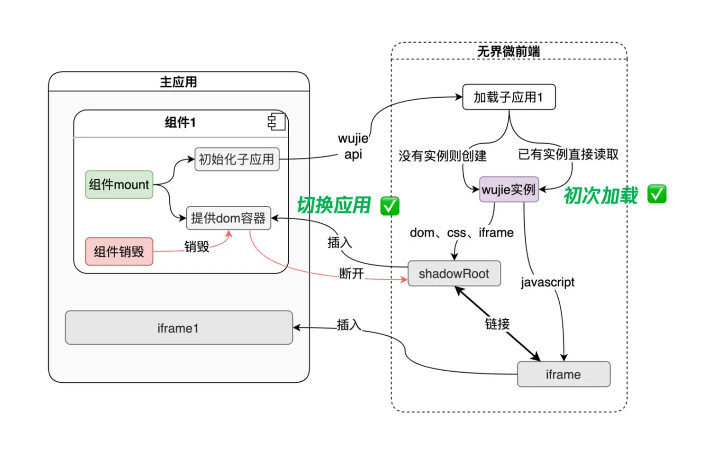

# 微前端初探

>微前端的概念是由ThoughtWorks在2016年提出的，它借鉴了微服务的架构理念，核心在于将一个庞大的前端应用拆分成多个独立灵活的小型应用，每个应用都可以独立开发、独立运行、独立部署，再将这些小型应用融合为一个完整的应用，或者将原本运行已久、没有关联的几个应用融合为一个应用。微前端既可以将多个项目融合为一，又可以减少项目之间的耦合，提升项目扩展性，相比一整块的前端仓库，微前端架构下的前端仓库倾向于更小更灵活。

他（部分）解决了以下问题：
1. 随着项目迭代应用越来越庞大，难以维护。
2. 跨团队或跨部门协作开发项目导致效率低下的问题。
3. 不同团队的技术栈差异问题。
4. 降低项目迭代过程中的技术栈升级或者重构成本，可达到渐进式重构的效果。

## 一个较为完备的微前端框架应该具备以下特征

> 这是随着几个微前端框架的迭代慢慢确立下来的，根据痛点进行优化。

1. js隔离（状态隔离）
2. 样式隔离
3. 通讯系统
4. 预加载能力
5. 生命周期系统
6. 微应用路由处理
7. 应用保活

## 常见的微前端框架

### iframe

> iframe是一个残缺且卓越的微前端解决方案

1. 完美的隔离，无论是js还是css
2. 微应用url不同步，后退前进不可以。
3. 每次打开微应用都是重新加载，不具备保活能力。

### singleSpa和乾坤

> 乾坤是基于singleSpa封装的，由此带来一系列问题，例如对微应用的入侵。
>
> 即，微应用需要在自己的入口 js (通常就是你配置的 webpack 的 entry js) 导出 bootstrap、mount、unmount 三个生命周期钩子，以供主应用在适当的时机调用。

1. 乾坤具有完善的沙箱方案。js的SnapshotSandbox、LegacySandbox、ProxySandbox，css的strictStyleIsolation、experimentalStyleIsolation。适合不同场景使用不同的方案。
2. 路由保持，浏览器刷新、前进、后退，都可以作用到子应用。
3. 在qiankun2.x版本中，也使用了shadow DOM进行css隔离

### mircoApp

> 来自京东团队的微前端框架是一款基于类web component组件

1. js沙箱，用`Proxy`拦截了用户全局操作行为，防止对window的访问。（但也提供了访问window的方法，不过并不友好）

```js
// 三种方法
new Function("return window")() 或 Function("return window")()
(0, eval)('window')
window.rawWindow
```

2. 用Shadow Dom或babel插件对样式转换来限制作用域。（简单来说是给所有样式加前缀）但是会受到基座应用的污染。

> shadow Dom是可开启的，具有更好的隔离性，但文档里面提醒了“一些框架(如React)对shadowDOM的兼容性不好，请谨慎使用。”
>
> 开启shadowDOM后，默认的样式隔离将失效。

```css
.test {
  color: red;
}

/* 转换为 */
micro-app[name=xxx] .test {
  color: red;
}
```

3. 元素隔离。对元素边界进行限制。

```js
// 简单来说 微应用和基座应用都有id为root的元素
<div id='root'></div>

// 此时子应用通过querySelector只会查询到子应用的id
document.querySelector('#root')
```

4. 支持预加载

> 预加载并不是同步执行的，它会在浏览器空闲时间，依照开发者传入的顺序，依次加载每个应用的静态资源，以确保不会影响基座应用的性能。


## 无界

> 无界是腾讯PCG的微前端方案，是iframe为基础的微前端方案,推荐一篇相关的文章。https://zhuanlan.zhihu.com/p/442815952
> 

无界的优势是，解决iframe方案的缺点。

- dom割裂严重的问题，主应用提供一个容器给到shadowRoot插拔，shadowRoot内部的弹窗也就可以覆盖到整个应用A
- 路由状态丢失的问题，浏览器的前进后退可以天然的作用到iframe上，此时监听iframe的路由变化并同步到主应用，如果刷新浏览器，就可以从url读回保存的路由
- 通信非常困难的问题，iframe和主应用是同域的，天然的共享内存通信，而且无界提供了一个去中心化的事件机制
- iframe加载的性能问题，`wujie`是通过提前实例化和保存`shadowRoot`来实现的。


