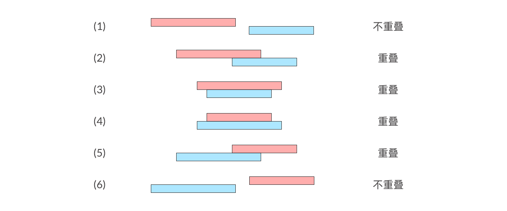

# evajs简单介绍

Eva.js 是一个专注于开发互动游戏项目的前端游戏引擎。选用这个库的原因主要是开箱即用。

是淘宝团队的一款开源库，天猫农场，金币庄园，

> demo的Url https://yeyanbin.github.io/mac-dialog-demo/dist/

## 资源管理

游戏中所用到的所有资源都会放在资源管理器中进行管理，在使用资源之前需要将资源添加到资源管理器中，并为资源设置一个资源名，在需要时直接使用资源名。

```js
// 引入一个资源
resource.addResource([
  {
    name: 'bear',
    type: RESOURCE_TYPE.IMAGE,
    src: {
      image: {
        type: 'png',
        url: getUrlPrefix() + '/bunny.png'
      },
    },
    preload: true,
  },
]);
```

## 游戏 Game

通过 Game 实例上的方法，控制游戏暂停、继续。通过将 System 添加到 Game 上让游戏能够支持不同的能力，这些能力都是通过组件添加到 GameObject 上展现出来的。

### 添加系统​

我们可以在创建的时候添加系统

```js
// 创建一个游戏
const canvas = document.querySelector('#game-canvas');

const game = new Game({
  systems: [
    // 渲染系统
    new RendererSystem({
      canvas,
      width: 1000,
      height: 1000,
      backgroundColor: 0x999999
    }),
    // 图片系统
    new ImgSystem(),
  ],
});
```

## 游戏对象 GameObject

游戏对象是游戏的基本元素，代表人物、物体、风景等。

## 创建一个角色

```js
// 创建游戏对象，bear
const bear = new GameObject('bear', {
  size: { width: 30, height: 40 },
  origin: { x: 0.5, y: 0.5 },
  position: {
    x: 500,
    y: 500,
  },
  anchor: {
    x: 0,
    y: 0,
  },
});

// 添加子组件，为小熊的图片
bear.addComponent(
  new Img({
    resource: 'bearImg',
  })
);

// 把该游戏对象加入到游戏里。
game.scene.addChild(bear);
```

## Ticker

增加每帧执行的方法

```js
game.ticker.add((e: UpdateParams)=>{
  // 这个部分的代码会每帧都执行一遍
});
```

## 控制角色的移动

### 一，跟随鼠标移动

这里我们用挂载原生的事件来实现。**参考跟随鼠标Demo**

```js
canvas.addEventListener('mousemove', (ev) => {
  bear.transform.position = {
    x: ev.offsetX,
    y: ev.offsetY,
  };
  ev.stopPropagation()
});
```

### 二，用键盘控制移动

这里需要引入一个数学上的概念，反正切函数 $ y =arctan（x）$，我们需要用到他来获取移动的方向。**参考点击移动Demo，键盘移动Demo和双人移动Demo**

```js
// 获取角度
const rotateToPoint = (mx, my, px, py) => {
  const dist_Y = my - py;
  const dist_X = mx - px;
  const angle = Math.atan2(dist_Y, dist_X);
  return angle;
}

// 记录移动方向的角度
const rotatesMap = {
  "right": 0,
  "up": -Math.PI/2,
  "left": Math.PI,
  "down": Math.PI/2,
  "right+up": -Math.PI/4,
  "left+up": -Math.PI*3/4,
  "right+down": Math.PI/4,
  "left+down": Math.PI*3/4
}
```

我们获取到移动的方向之后，就可以绑定对应的移动按键，然后在Ticker中改变GameObject来实现移动动画。

```js
// Ticker
game.ticker.add((e: UpdateParams)=>{
  // 是否允许移动
  if (move.isMove) {
    // 计算移动距离
    const moveDis = move.moveSpeed * (Date.now() - move.lastMoveTime)/1000;
    
    // 计算下一个坐标
    const position = gameObj.transform.position;
    position.x += Math.cos(move.moveRotation) * moveDis;
    position.y += Math.sin(move.moveRotation) * moveDis;
    move.lastMoveTime = Date.now();
  }
});
```

### 子弹与碰撞

#### 射击行为

到了这里我们就可以实现游戏对象GameObject的移动了，而角色和子弹都是游戏对象，所以我们可以用上述方法去实现子弹的移动。**参考点击射击Demo，自动射击Demo和随机射击Demo**

```js
// 1. 定义子弹的属性，速度
const bulletSpeed = 50;
const bullets: GameObject[] = [];
let lastMoveTime = Date.now();

// 2. 绑定点击事件，获取射击角度和开始位置
canvas.addEventListener('mousedown', (ev) => {
  ev.stopPropagation()
  const { offsetX, offsetY } = ev; 
  shoot(rotateToPoint(offsetX, offsetY, bear.transform.position.x, bear.transform.position.y), bear.transform.position);
});

// 3. 创建子弹的游戏对象，绑定子弹的图片资源，加入到子弹集合
function shoot(rotation, startPosition) {

  const bulletsGameObj = new GameObject('gameObject1', {
    size: { width: 25, height: 12 },
    origin: { x: 0.5, y: 0.5 },
    position: startPosition,
    rotation
  })
  bulletsGameObj.addComponent(
    new Img({
      resource: 'bullet',
    })
  );

  bullets.push(bulletsGameObj);
  game.scene.addChild(bulletsGameObj);
}

// 4. 设置子弹的射击动画
game.ticker.add((e: UpdateParams) => {
  for (let bulletIndex = bullets.length - 1; bulletIndex >= 0; bulletIndex--) {
    const moveDis = bulletSpeed * (Date.now() - lastMoveTime)/1000;
    const position = bullets[bulletIndex].transform.position;
    position.x += Math.cos(bullets[bulletIndex].transform.rotation) * moveDis;
    position.y += Math.sin(bullets[bulletIndex].transform.rotation) * moveDis;
  }
});

```

> 实际上需要考虑子弹的边界，怎么停止，但这里先省略。

### 碰撞检测


每个游戏对象都可以看成是一个矩形，所以可以将这个问题转化为判断矩形重叠。

对于矩形重叠就可以很轻松的用投影到坐标轴上进行降维处理，这个问题就变成判断区间重叠。

也就是，当同时满足y轴上的投影重叠和x轴上的投影重叠，我们可以得到出这两个矩形有重叠。




```js
interface IRect {
    x: number;
    y: number;
    width: number;
    height: number;
}
export const isRectangleOverlap = (rec1: IRect, rec2: IRect) => {
    const x_overlap = !(rec1.x + rec1.width <= rec2.x || rec2.x + rec2.width <= rec1.x);
    const y_overlap = !(rec1.height + rec1.y <= rec2.y || rec2.y + rec2.height <= rec1.y);
    return x_overlap && y_overlap;
}
```

#### 朴素碰撞检测

我们判断每一帧的子弹有没有击中目标，最简单的方法就是迭代所有子弹，然后让每个子弹和每个怪物进行矩阵重叠测试。**参考碰撞demo和Cat**


```js

// 迭代每一个子弹
for (let bulletIndex = bullets.length - 1; bulletIndex >= 0; bulletIndex--) {

  const { bulletWidth, bulletHeight } = bullets[bulletIndex];
  const position = (bullets[bulletIndex].content as GameObject).transform.position;

  // 迭代每一个怪物
  monsters.forEach((monsterData) => monsterData.monsterList.forEach((monster) => {

    // 判断重叠
    if (isRectangleOverlap({
      x: position.x - bulletWidth * 0.5,
      y: position.y - bulletHeight * 0.5,
      width: bulletWidth,
      height: bulletHeight
    }, {
      x: monster.obj.transform.position.x - monster.width * 0.5,
      y: monster.obj.transform.position.y - monster.height * 0.5,
      width: monster.width,
      height: monster.height,
    })) {
      // 处理击中事件
      hitCallback(bullets[bulletIndex], monster);
    }
  }));
}

```

> 然后在这里遇到了性能问题，具体可以看 Cat，在子弹数和怪物数量达到一定程度的时候会出现卡顿。通过性能测试确认是碰撞逻辑的问题。

#### 优化思路

扫描线算法是在计算几何中常用的一种技巧，我们需要模拟一条线，从下到上去处理。如下图（计算矩形面积）。其关键点是矩阵边的离散化。


找到的一个动图，离散化简单来说就是只需要扫描下面停顿的地方就可以了，扫描过程中是一步步的，而不是连续的。


然后，就可以转化为一个区间问题了，通常用线段树去解决，这里就不展开。


---

上述的例子是求矩形面积的，在碰撞检测的中，我们应当对所有子弹和怪兽进行离散化处理，先构建待扫描的队列。

##### 构建扫描队列
```js
  // 构建待扫描队列
  const list = [];
  bullets.forEach((item) => {
    // 加入子弹的上边到队列
    list.push({
      y: item.y_1,
      item,
      type: TYPE_MAP.BULLET
    });
    // 加入子弹的下边到队列
    list.push({
      y: item.y_2,
      item,
      type: TYPE_MAP.BULLET
    });
  });

  monsters.forEach((item) => {
    list.push({
      y: item.y_1,
      item,
      type: TYPE_MAP.MONSTER
    });
    list.push({
      y: item.y_2,
      item,
      type: TYPE_MAP.MONSTER
    });
  });

  // 排序
  list.sort((a, b) => a.y - b.y);
```

##### 迭代队列的每个元素，并且分类处理

对于每个元素，我们分为怪物和子弹两种类型。每种类型都包括上边和下边。
当扫描到上边的时候，加入到待检测碰撞队列，扫描下边的时候退出队列。

由此可得到四种情况：

1. 子弹的上边。（指第一次扫到的边）
2. 子弹的下边。
3. 怪物的上边。
4. 怪物的下边。


从图里可以看出，当怪物A的上边被迭代到的时候，子弹队列里里面有两个元素，分别为1和2，所以我们只需要让怪物A和子弹1与子弹2进行碰撞检测便可以了，相当于缩小了对比的范围。

例如，黄色小花只需要和红色部分的怪兽进行碰撞检测就可以了。


###### 但是实际上，我们可以进一步优化一下

根据实际情况，我们大可认为一个子弹或者一个怪物的高度不高于100个像素点，那就可以将上面的红色方块切割成若干个100像素点高的小方块，那样我们就可以进一步的缩小对比范围。


```js

    // 扫到子弹，且子弹退出了
    if (item.type === TYPE_MAP.BULLET && item.y === item.item.y_2) {
      // 标记子弹已销毁
      item.item.isDestory = true;
    }
    // 扫到子弹，且子弹是刚进入的
    if (item.type === TYPE_MAP.BULLET && item.y === item.item.y_1) {

      const { x_1, x_2 } = item.item;
      const x_1_index = Math.floor(x_1/100);
      const x_2_index = Math.floor(x_2/100);

      // 收集未销毁的怪物
      temp_array = []

      for (temp_index = monsterList[x_1_index].length-1; temp_index >= 0 ; temp_index--) {

        const monster = monsterList[x_1_index][temp_index];
        // 跳过被销毁的怪物
        if (monster.item.isDestory ) {
          break;
        }
        temp_array.push(monster);

        // 判断是否重叠
        if (isRectangleOverlap(monster.item, item.item)) {
          hitCallback(item.item, monster.item);
          break;
        }
      }
      // 重置一下
      monsterList[x_1_index] = temp_array;


      // 没有重叠，且跨越了两个区间
      if (temp_index === -1 && x_1_index !== x_2_index) {
        temp_array = []

        for (temp_index = monsterList[x_2_index].length-1; temp_index >= 0 ; temp_index--) {

          const monster = monsterList[x_2_index][temp_index];
          // 跳过被销毁的怪物
          if (monster.item.isDestory ) {
            break;
          }
          // 没有销毁的
          temp_array.push(monster);


          // 判断是否重叠
          if (isRectangleOverlap(monster.item, item.item)) {
            hitCallback(item.item, monster.item);
            break;
          }
        }
        
        // 把没有销毁的怪物加回去
        monsterList[x_2_index] = temp_array;

        // 没有重叠的，新子弹进去子弹队列
        if (temp_index === -1) {
          bulletList[x_2_index].push(item);
        }
      }
      // 没有重叠的，新子弹进去子弹队列
      if (temp_index === -1) {
        bulletList[x_1_index].push(item);
      }
    }
```

扫描到怪物的情况与子弹类似，就省略代码部分啦。

> 思路上与四叉树碰撞检测相似。

#### 性能分析

通过chrome的性能分析可以看出，Cat（碰撞检测优化）DEMO遇到的性能瓶颈是渲染元素过多导致的，而不是因为碰撞逻辑。

### 分享完啦，感谢大家