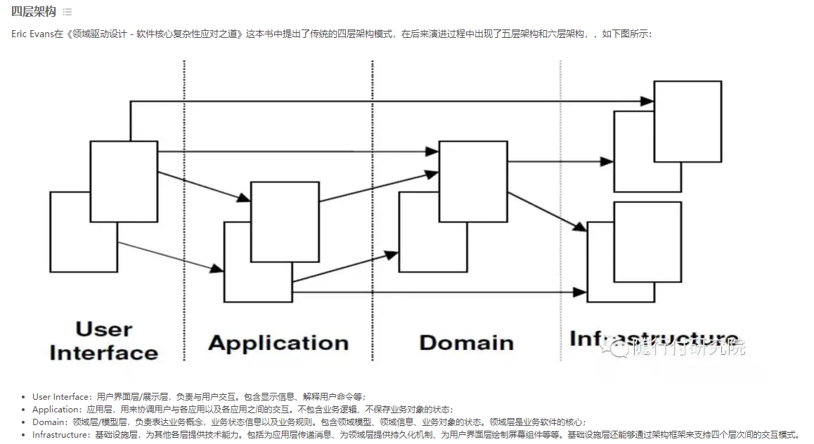
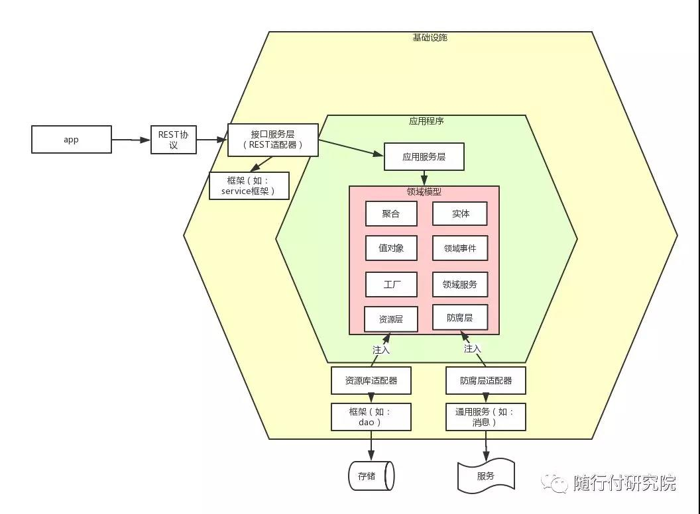

# DDD的四层架构

## 先看看后端大佬的理解

- User Interface：用户界面层/展示层，负责与用户交互。包含显示信息、解释用户命令等；
- Application：应用层，用来协调用户与各应用以及各应用之间的交互。不包含业务逻辑、不保存业务对象的状态；
- Domain：领域层/模型层，负责表达业务概念，业务状态信息以及业务规则。包含领域模型、领域信息、业务对象的状态。领域层是业务软件的核心；
- Infrastructure：基础设施层，为其他各层提供技术能力。包括为应用层传递消息、为领域层提供持久化机制、为用户界面层绘制屏幕组件等等。基础设施层还能够通过架构框架来支持四个层次间的交互模式。



## 在前端中四层架构

    参考了后端MVC与DDD四层架构的区别，并且推到到前端。（MVVM是数据驱动的）

- 梳理了一下
  - User Interface：用户界面层/展示层，负责与用户交互。（前端里应该就是视图层叭，例如template或者jsx部分。）
  - Application：应用层。应用之间的链接部分，使用各种领域和模型。**\*（感觉可以叫胶水层？连接领域和视图层）**
  - Domain：领域层/模型层，负责表达业务概念，业务状态信息以及业务规则。**\*（核心业务层）**
  - Infrastructure：基础设施层，为其他各层提供技术能力。（封装https，utils之类的杂活）

> 这里让我想到了Function-based API提案解决的问题，[文档](https://v3.cn.vuejs.org/guide/composition-api-introduction.html#%E4%BB%80%E4%B9%88%E6%98%AF%E7%BB%84%E5%90%88%E5%BC%8F-api)
>


# 六边形架构



> 在我看来，六边形架构更像是四层架构的一种详细介绍，虽然这个图是后端的，但是对前端依然有着巨大的参考价值。

## 领域模型 domain

> DDD全称为Domain Driven Design，领域驱动设计。理所当然，领域domain就是在DDD建模方法中最重要的东西。

六边形架构中，领域模型包括：**聚合，实体，值对象**，领域事件，工厂，领域服务，资源层，防腐层。这里先看前三个。

### 实体与值对象

- **实体**：当一个对象由其标识区分，这种对象称为实体（Entity）。（不可重复）
- **值对象**：当一个对象用于对事务进行描述而没有唯一标识时，被称为值对象（Value Object, VO）。具有不变性、相等性和可替换性。

例如：
  我们每个工作日都需要乘坐交通工具去上班。

在这个例子中：

- “我们”具有唯一标识（身份证），是实体。

```ts
interface IPeople {
  id: string; // 唯一标识
  name: string;
}
```

- “乘坐公共交通”，是值对象。包含的信息可以是什么时候乘坐了什么类型的交通工具

```ts
interface ICommuterInfo {
  type: 'car' | 'subway' | 'other';
  time: Date;
}
```

>
- 谨慎使用值对象
  - 很多领域对象看起来符合值对象的概念，但是在具体业务中，我们需要给其加上唯一标识。

```txt
用户分组 UserGroup，如果需要唯一标识就是实体，不然就是VO。

看起来，可以套用统计学意义上的事件集合来判断需不需要唯一标识。
```

### 聚合

- **聚合**：Aggregate，是一组相关对象的集合。由根实体，值对象和实体组成。
- **聚合根**：是这个聚合的根节点。

### 限界上下文

- **限界上下文**: 一个由显示边界限定的特定职责。领域模型便存在于这个边界之内。在边界内，每一个模型概念，包括它的属性和操作，都具有特殊的含义。实体，值对象，聚合，聚合根都是限界上下文内部的元素。

> 感觉一个限界上下文可以理解为一个模块。划分限界上下文和划分模块差不多的感觉。

挺多人推荐的美团团队技术文章中，对抽奖上下文的划分。


# 参考资料

<https://tech.meituan.com/2017/12/22/ddd-in-practice.html>
<https://www.cnblogs.com/duanxz/p/9922170.html>

<https://mp.weixin.qq.com/s/3oa6pDQVrxKWI7IrN5ZKRQ>
